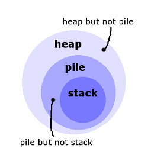

# SMP - Core

A Js playground to manipulate json objects and generate a timeline as output.

# Stack - pile and heap concepts

First, you know that all of these terms refer to many things all located close to each other so they are thought of as related as a group. Usually, if they are physical things, they will be very close, maybe even touching each other, often on top of each other. If they are abstract things, then they are related in another sense of close together or collected.

Usually, these terms are not used for live or animate things, unless to make a point by being odd. However, they can be used for dead things, e.g., a pile of corpses.

Now, there are two properties that you have to ask about to tell the terms apart.

How big is the group?
How organized is the group?
A heap is big. A stack and pile can be small, medium, or big.

A stack is organized. A pile and heap can be organized or unorganized, but often unorganized. Other concepts similar to organization here are alignment and order.

These are only the main meanings that come to mind. It would not be incorrect to say that an organized group of papers is a pile of papers. It would also not be wrong to tell someone to organize a stack of papers, because maybe it is not organized to this person's standards.

So if a group of papers is small, you should not call it a heap. And if a group of papers is very messy, you should not call it a stack. The others are more flexible and vague.

When you are talking about abstract objects, you should be more careful about using stack and pile. It is common to say he is in a heap of trouble, I have a heap of problems, or I'm gonna/going to give him a heaping of hurt. The word mound also covers some of the same ground. It is less common to describe a group of abstract things as a pile or stack. Two notable exceptions are of course when these are technical terms for mathematical objects or datatypes. I suspect this might be because the real meaning that heap adds in the former case is bigness. I have a heap of problems means that you have a lot of problems all close together.

If this is a lot to remember at once, you can think roughly of these terms as growing increasingly specific. RoaringFish's comment made me think of this ordering, which is by increasing messiness:

- stack ≤ pile ≤ heap

You might also think of these as being proper inclusions if you are familiar with sets:

- stack ⊂ pile ⊂ heap

This picture depicts these relationships.

# Stock vs Stack

I would define “stock knowledge” as the set of structured, systemic, and contextual information that one has already learned and internalized; it is preexisting knowledge, as opposed to knowledge that one doesn’t have or has yet to learn and understand. 

As to “stack knowledge,” I must tell you that whatever it means isn’t part of my stock knowledge yet. This is my very first encounter with that noun phrase, so I can’t tell you offhand how it might differ from “stock knowledge.” In fact, a cursory search on the web has convinced me that “stack knowledge” doesn’t exist in the English lexicon at all.

You see, there are strings of words in English that are known as collocations—familiar groupings of words that commonly go together and convey meaning by association. To this category of words belong such verb phrases as “feel free,” “make progress,” and “save time”; such noun phrases as “powerful computer” and “strong coffee” (as opposed to “strong computer” and “powerful coffee,” respectively, which are very poor collocations); and such idiomatic expressions as “gone with the wind,” “straight as the crow flies,” and “tempest in a teapot.” 

The noun phrase “stock knowledge” is clearly a strong collocation that consists of the noun “knowledge” modified by the adjective “stock” in the sense of “commonly used or often brought forward.” On the other hand, when looked upon as a noun phrase, “stack knowledge” doesn’t qualify as a collocation because it fails to convey a clear and identifiable meaning by association. Differentiating “stock knowledge” from “stack knowledge” is therefore like differentiating apples from desktop computers, which is clearly not a very meaningful exercise. 

Indeed, “stack knowledge” won’t sound nonsensical only when we look at “stack” as a verb in the sense of “to arrange in an orderly pile or heap,” with “knowledge” as its direct object. We can then use “stack knowledge” in a sentence like, say, “The function of a computer’s hard disk is to stack knowledge in a memory bank for long-term storage.” This is a very unnatural-sounding sentence, of course, but we can make it semantically more precise by replacing the word “knowledge” with “information.” This time, the verb phrase “stack information” works very well because it’s a fairly strong collocation by itself.